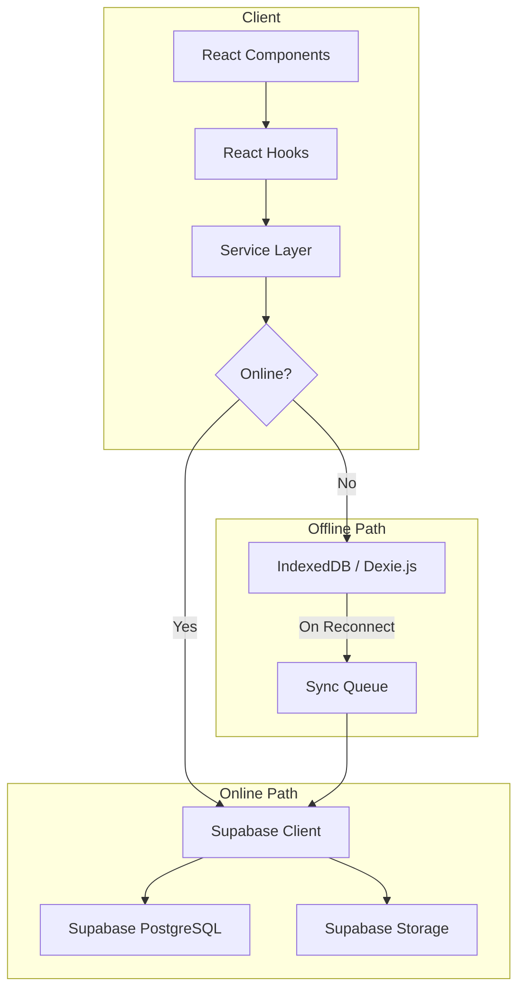

# Supabase Integration — Implementation Plan

## Current State

- **Framework:** Next.js 15.3.5 (App Router) + TypeScript
- **Existing DB:** Prisma + SQLite (minimal, boilerplate User/Post models — not used by the app)
- **Data:** All dashboard data is currently **hardcoded mock data** in `page.tsx`
- **Auth:** `next-auth` is installed but not actively used
- **State:** Zustand is installed, react-query available

This means the Supabase integration is **greenfield backend work** — there's no production data to migrate, just mock data to replace with real Supabase-backed data.

---

## Architecture



---

## Proposed Changes

### Phase 1: Foundation (Client, Types, ENV)

#### [NEW] `src/lib/supabase.ts`
Singleton Supabase client using `@supabase/supabase-js`. Initializes once, reusable everywhere.

#### [NEW] `src/types/database.ts`
TypeScript interfaces for all database tables: `Coconut`, `AIPrediction`, `PollinationSchedule`, `Alert`, `ActivityLog`, `User`. Generated from the SQL schema.

#### [MODIFY] `.env.local`
Add Supabase credentials:
```
NEXT_PUBLIC_SUPABASE_URL=https://sgxwukaahxambfrxsoiq.supabase.co
NEXT_PUBLIC_SUPABASE_ANON_KEY=sb_publishable__mIdMT8K7JxQt8qbD82kDQ_3AGjI9hS
```

#### [MODIFY] `.env.example`
Add template entries for Supabase credentials.

---

### Phase 2: SQL Schema & Storage

#### [NEW] `supabase/schema.sql`
Complete PostgreSQL schema with:

| Table | Purpose | Key Fields |
|---|---|---|
| `users` | Future auth | id, full_name, email, role |
| `coconuts` | Coconut records | id, name, tree_number, farm_block, location, image_url, ai_summary, predictions |
| `ai_predictions` | Classification history | coconut_id FK, mature/tender probs, confidence, model versions |
| `pollination_schedule` | Scheduling | coconut_id FK, scheduled_date, expected_ready_date, status |
| `alerts` | Alert system | coconut_id FK, title, message, type, is_read |
| `activity_logs` | Audit trail | coconut_id FK, action, description, timestamp |

Includes: PKs, FKs with CASCADE, indexes, RLS policies, storage bucket creation.

> [!IMPORTANT]
> The SQL file will need to be run manually in the Supabase SQL Editor (Dashboard → SQL Editor → New Query → Paste & Run). This is standard for Supabase projects.

---

### Phase 3: Service Layer

#### [NEW] `src/services/coconutService.ts`
CRUD operations: `saveCoconut()`, `updateCoconut()`, `deleteCoconut()`, `getCoconuts()`, `getCoconutById()`, `searchCoconuts()`

#### [NEW] `src/services/scheduleService.ts`
Schedule CRUD: `createSchedule()`, `updateSchedule()`, `deleteSchedule()`, `getSchedules()`, `completeSchedule()`, `rescheduleSchedule()`

#### [NEW] `src/services/alertService.ts`
Alert management: `createAlert()`, `getAlerts()`, `markAsRead()`, `deleteAlert()`, `createAutoAlerts()`

#### [NEW] `src/services/storageService.ts`
Image storage: `uploadImage()`, `deleteImage()`, `getPublicUrl()`

#### [NEW] `src/services/activityLogService.ts`
Audit logging: `logActivity()`, `getActivityLogs()`

#### [NEW] `src/services/authService.ts`
Auth preparation: `getCurrentUser()`, `signIn()`, `signOut()` — prepared for future use.

---

### Phase 4: Offline Support

#### [NEW] `src/lib/offlineDb.ts`
Dexie.js IndexedDB database with tables mirroring Supabase: `coconuts`, `schedules`, `alerts`, `syncQueue`.

#### [NEW] `src/lib/syncManager.ts`
Sync queue processor: detects online/offline state, queues mutations when offline, replays them on reconnect with conflict resolution.

#### [NEW] `src/hooks/useOnlineStatus.ts`
React hook that tracks `navigator.onLine` and fires on connectivity changes.

---

### Phase 5: React Hooks

#### [NEW] `src/hooks/useCoconuts.ts`
React Query hook wrapping `coconutService` with offline fallback.

#### [NEW] `src/hooks/useSchedules.ts`
React Query hook for pollination schedules.

#### [NEW] `src/hooks/useAlerts.ts`
React Query hook for alerts with auto-refresh.

---

### Phase 6: API Integration (Save Workflow)

#### [MODIFY] `src/app/api/coconut/predict-unified/route.ts`
After prediction, return data structured for the save workflow (no database write here — the client decides when to save).

#### [NEW] `src/app/api/coconut/save/route.ts`
Server-side API route that orchestrates the full save workflow:
1. Upload image to Supabase Storage
2. Save coconut record to database
3. Create initial pollination schedule
4. Create initial alert
5. Log activity

---

### Phase 7: UI Integration

#### [MODIFY] `src/app/page.tsx`
- Replace hardcoded mock data with Supabase-backed hooks
- Add save dialog after classification
- Connect schedule/alerts views to real data
- Keep all existing UI structure and styling

> [!WARNING]
> The page.tsx modifications will be the most delicate part. I'll preserve all existing JSX structure and only replace the data sources.

---

## File Summary

| File | Action | Layer |
|---|---|---|
| `src/lib/supabase.ts` | NEW | Client |
| `src/lib/offlineDb.ts` | NEW | Offline |
| `src/lib/syncManager.ts` | NEW | Offline |
| `src/types/database.ts` | NEW | Types |
| `src/services/coconutService.ts` | NEW | Services |
| `src/services/scheduleService.ts` | NEW | Services |
| `src/services/alertService.ts` | NEW | Services |
| `src/services/storageService.ts` | NEW | Services |
| `src/services/activityLogService.ts` | NEW | Services |
| `src/services/authService.ts` | NEW | Services |
| `src/hooks/useCoconuts.ts` | NEW | Hooks |
| `src/hooks/useSchedules.ts` | NEW | Hooks |
| `src/hooks/useAlerts.ts` | NEW | Hooks |
| `src/hooks/useOnlineStatus.ts` | NEW | Hooks |
| `src/app/api/coconut/save/route.ts` | NEW | API |
| `supabase/schema.sql` | NEW | Database |
| `.env.local` | MODIFY | Config |
| `.env.example` | MODIFY | Config |
| `src/app/page.tsx` | MODIFY | UI |

**Total: 16 new files, 3 modified files**

---

## Verification Plan

### Automated Tests
```bash
npm run build
```

### Manual Verification
1. Run SQL schema in Supabase Dashboard SQL Editor
2. Create `coconut-images` storage bucket in Supabase Dashboard
3. Start the app, navigate to Classifier, upload & classify a coconut image
4. Save the result → verify record appears in Supabase Dashboard (Tables, Storage)
5. Check Schedule tab → verify new schedule entry
6. Check Alerts tab → verify initial alert
7. Go offline (DevTools → Network → Offline) → verify cached data still displays
8. Create a record offline → go online → verify sync

---

## Open Questions

> [!IMPORTANT]
> **Storage bucket access**: Should the `coconut-images` bucket be public (anyone with URL can view images) or private (requires auth token)? For a farm management app, **public** is simpler and recommended — images aren't sensitive. The plan assumes public.

> [!IMPORTANT]
> **RLS during development**: Row Level Security will be configured but with a permissive "allow all" policy initially (since there's no auth yet). When auth is added later, policies will be tightened to per-user access. This matches the "prepare for future multi-user support" requirement.
